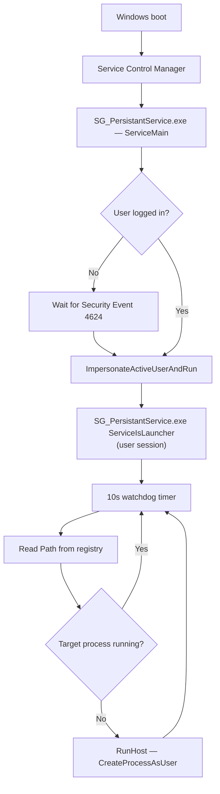

# SG PersistantService

A native C++ Windows service that keeps an interactive desktop application running across reboots, user logon/logoff, and unexpected process termination.

**Version 2.0** · Secured Globe, Inc. · [CodeProject article](https://www.codeproject.com/Articles/5345258/Thank-You-for-Your-Service-Creating-a-Persistent-I)

---

## Overview

Windows services run in **Session 0** and cannot normally launch GUI applications in a logged-on user's desktop session. Applications started manually by a user also do not survive reboots unless something restarts them.

**SG PersistantService** addresses both problems:

1. Installs as an **auto-start Windows service** so it is active after reboot or shutdown.
2. Waits for a user to log on, then launches a **user-session watchdog client** in that session.
3. **Monitors the target executable** every 10 seconds and restarts it if it is not running.

The same binary acts as the Windows service, the user-session launcher, and the interactive installer.

---

## Features

| Feature | Description |
|---------|-------------|
| **Auto-start service** | Registered as `SG_PersistantService` with `SERVICE_AUTO_START` |
| **User-session launch** | Spawns the watched app in the active user desktop via token impersonation |
| **Watchdog timer** | Polls every 10 seconds; restarts the target process when missing |
| **Logon detection** | Subscribes to Security Event Log (Event ID 4624) and uses WTS session APIs |
| **Session change handling** | Responds to `WTS_SESSION_LOGON` / `WTS_SESSION_LOGOFF` |
| **Registry-based config** | Target executable path stored under `HKLM\SOFTWARE\SG_PersistantService` |
| **Runtime logging** | Writes `log.txt` next to the service executable |

---

## Architecture



### Executable modes

`SG_PersistantService.exe` runs in one of three modes depending on its command line:

| Mode | Command line | Role |
|------|--------------|------|
| **Service** | *(no arguments)* | Registered with SCM; waits for logon and spawns launcher |
| **Launcher** | `ServiceIsLauncher` | Hidden-window client in user session; runs watchdog timer |
| **Install** | `Install#<full-path-to-exe>` | Creates registry key, registers service, starts service |

---

## Requirements

- **OS:** Windows 10 or later (x86 or x64)
- **Build:** Visual Studio 2022 with Desktop development with C++
- **SDK:** Windows 10 SDK
- **Privileges:** Administrator rights required to install the service (UAC manifest: `RequireAdministrator`)
- **Runtime:** No .NET or third-party runtime — native Win32 only

---

## Repository structure

```
PersistantService/
├── SG_PersistantService.sln       # Visual Studio solution
├── SG_PersistantService/           # Service executable project
│   ├── SG_PersistantService.cpp    # Service logic, launcher, installer
│   └── SG_PersistantService.h
├── SampleApp/SampleApp/            # Demo Win32 GUI app for testing
│   └── SampleApp.cpp
├── uninstall.bat                   # Stop service and remove registration
└── LICENSE                         # GNU LGPL 2.1
```

**Build output:**

```
bin\<Platform>\<Configuration>\SG_PersistantService.exe
bin\<Platform>\<Configuration>\SampleApp.exe
```

---

## Build

Open `SG_PersistantService.sln` in Visual Studio 2022, or build from the command line:

```powershell
& "${env:ProgramFiles}\Microsoft Visual Studio\2022\Enterprise\MSBuild\Current\Bin\MSBuild.exe" `
  "SG_PersistantService.sln" `
  /p:Configuration=Release `
  /p:Platform=x64
```

Supported configurations: `Debug|Release` × `x86|x64`.

> **Note:** The service project references optional include/library paths (`common\`, `filterdrv_user\`, `lib\`) from a larger Secured Globe build tree. A clean clone builds the core service; ensure those paths exist or adjust the project if link errors occur.

---

## Installation

Run **as Administrator** from an elevated command prompt.

### 1. Install the service

Point the service at the executable you want to keep running. The path after `#` must exist at install time:

```cmd
SG_PersistantService.exe Install#C:\full\path\to\YourApp.exe
```

**Example (SampleApp demo):**

```cmd
SG_PersistantService.exe Install#C:\path\to\bin\x64\Release\SampleApp.exe
```

This will:

1. Create `HKLM\SOFTWARE\SG_PersistantService`
2. Register the Windows service `SG_PersistantService` (auto-start)
3. Start the service immediately

### 2. Verify

```cmd
sc query SG_PersistantService
```

Check `log.txt` in the same directory as `SG_PersistantService.exe` for startup and watchdog activity.

---

## Configuration

Configuration is stored in the registry — there are no config files or environment variables.

| Registry key | Value | Type | Purpose |
|--------------|-------|------|---------|
| `HKLM\SOFTWARE\SG_PersistantService` | `Path` | `REG_SZ` | Full path to the executable to watch and restart |

- Set at install time via the `Install#<path>` argument.
- Updated by `RunHost()` after a successful launch.

---

## Demo workflow (SampleApp)

1. Build `SampleApp.exe` and `SG_PersistantService.exe` (Release recommended).
2. Install the service pointing at `SampleApp.exe` (see above).
3. Log on to Windows — the service waits for logon, then starts SampleApp in your session.
4. Close `SampleApp.exe` manually — within ~10 seconds the watchdog restarts it.
5. Reboot — the service starts at boot, waits for logon, then launches SampleApp again.
6. Uninstall when finished (see below).

---

## Uninstall

Use the provided script **as Administrator**:

```cmd
uninstall.bat
```

Or manually:

```cmd
sc stop SG_PersistantService
sc delete SG_PersistantService
```

The batch file also terminates `sampleapp.exe` and `sg_persistantservice.exe` if still running.

---

## Logging

| Item | Detail |
|------|--------|
| **File** | `log.txt` in the directory containing `SG_PersistantService.exe` |
| **Format** | Timestamped UTF-8 append log |
| **Console** | Debug console allocated at startup (`enableConsole`) |

Typical log entries include service start, logon wait, launcher spawn, process detection, and restart attempts.

---

## Technical reference

| Topic | Value |
|-------|-------|
| Service name | `SG_PersistantService` |
| Service description | `Secured Globe Windows Service` |
| Start type | Automatic |
| Watchdog interval | 10,000 ms |
| Logon event | Security channel, Event ID **4624** |
| Process enumeration | Toolhelp32 snapshot (`CreateToolhelp32Snapshot`) |
| Session APIs | WTS (`wtsapi32.lib`), `userenv.lib` |
| Linked libraries | `wtsapi32`, `userenv`, `psapi`, `wevtapi`, `shlwapi`, `version`, and others |

---

## Limitations

- **Proof of concept** — intended as a reference implementation, not a production-hardened watchdog.
- **Single target executable** — one `Path` value in registry; no multi-app orchestration.
- **Administrator required** — service installation and registry writes need elevated privileges.
- **Session 0 isolation** — the service itself never runs the GUI app directly; it always delegates to the user-session launcher.
- **No remote management** — no network protocol, REST API, or centralized monitoring.
- **Optional build dependencies** — `fltLib.lib` and external `common\` paths may be required in some Secured Globe build environments.

---

## License

This project is licensed under the **GNU Lesser General Public License v2.1**. See [LICENSE](LICENSE) for the full text.

---

## Author & links

- **Author:** Michael Haephrati — [haephrati@gmail.com](mailto:haephrati@gmail.com)
- **Organization:** [Secured Globe, Inc.](https://www.securedglobe.net)
- **Article:** [Thank You for Your Service — Creating a Persistent Interactive Windows Service](https://www.codeproject.com/Articles/5345258/Thank-You-for-Your-Service-Creating-a-Persistent-I)
- **Repository:** [github.com/securedglobe/PersistantService](https://github.com/securedglobe/PersistantService)

---

## Related projects

SG PersistantService is a **standalone Windows utility**. It is not wired to other Secured Globe products (e.g. Scrubber, SG_SqliteServer) in this repository, but it can be used to keep any Win32 desktop executable running persistently by substituting your application's path in the install command.
